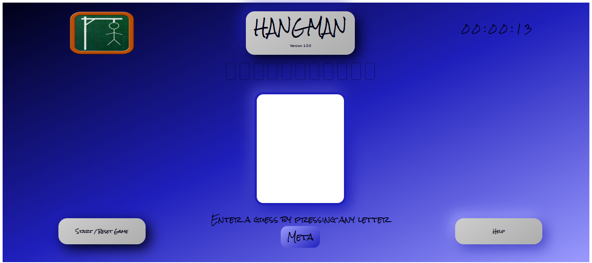
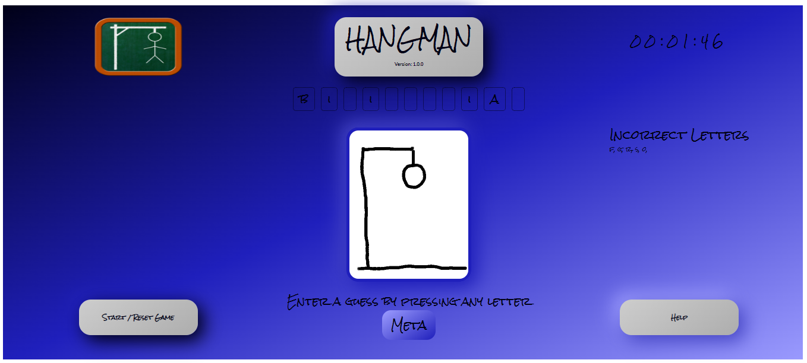
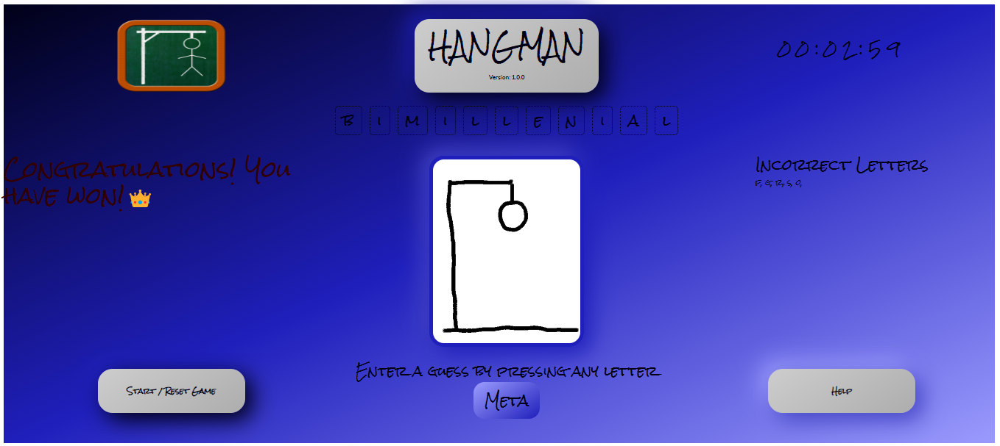
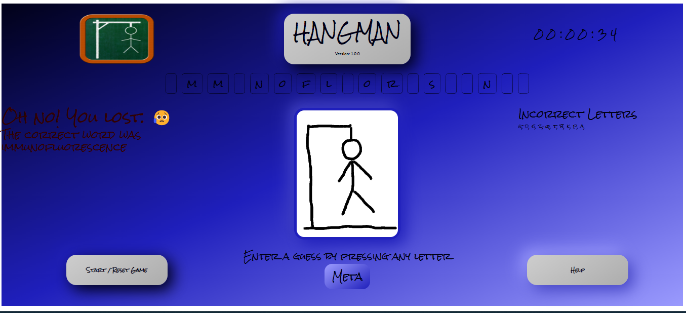

# Hangman v1.0.0 - Johann Jansen van Vuuren

## Index

1. Introduction
2. Installation and Running
3. Instructions
4. Credits

This project was bootstrapped with [Create React App](https://github.com/facebook/create-react-app).

## 1. Introduction

This is a simple Hangman game that was written in React as an exercise in the Immersive Full Stack and Software Engineer Boot Camp at HyperionDev. It was one of the Capstone Projects where the purpose was to consolidate the knowledge of React basics and State Management.  

## 2. Installation and Running

To install the application:  
- Download the code from the repo at [Hangman v1.0.0 - Johann Jansen van Vuuren](https://github.com/JohannJvanVuuren/hangman)
- Unzip the downloaded file
- In the root of the project run the command `yarn install`
- Once all the dependencies have been installed run the command `yarn start`

## 3. Instructions

The game is very easy to play:  
- A random word will be generated at the start of the game
- The player has 10 letters to guess the correct word
- Each incorrect guess will result in a line being added to the hangman
- When the hangman figure is completed the player loses
- Each correct guess will be added the placeholders of the correct word
- With each correct letter the word becomes easier to guess
- When the word is completed before the hangman figure is completed the player wins
- A message will appear in either of the two scenarios to notify the player that they have won or lost
- During the game the player can click on the help button for instructions
- The stopwatch will be rest when the player does so
- During the game the player can reset the game by clicking on the start or reset game button
- The player can also start a new game at the end of a game by clicking the same button
- The stopwatch will reset and a new game will start

### 3.1 Beginning Of A Game

### 3.2 A Game In Progress

### 3.3 The End Of A Winning Game

### 3.4 The End Of A Losing Game

## 4. Credits

This application was designed and created by Johann Jansen van Vuuren in February 2023.